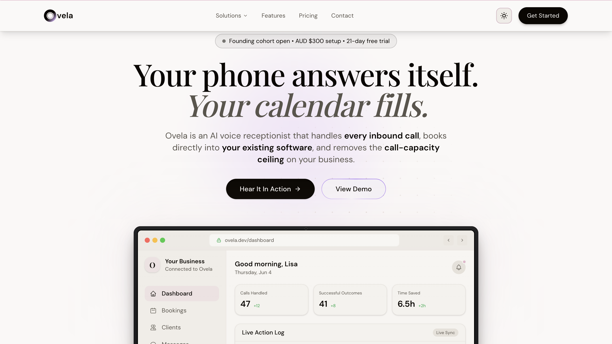
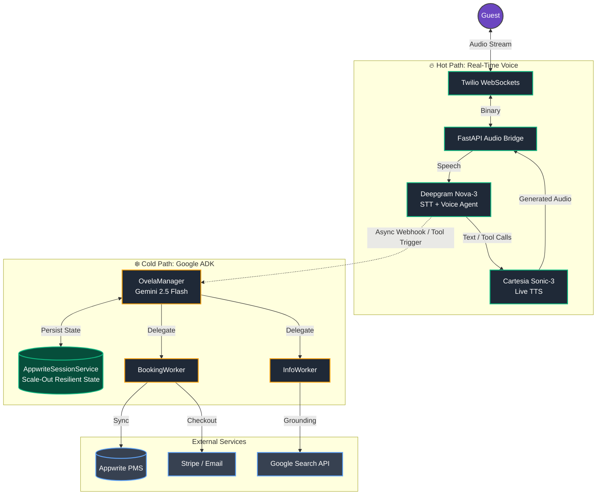
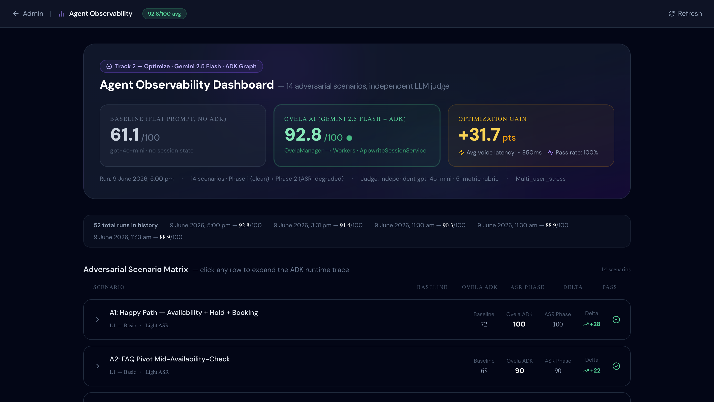

<div align="center">
  
  
  <br />
  
  **An ultra-low latency, multi-agent conversational voice system for hospitality, powered by the Gemini Enterprise Agent Platform.**
  
  <br />

  [](#)
  [](#)
  [](#)
  [](#)
</div>

<br />

## ⚡ Key Capabilities

Ovela AI transcends typical chatbot limitations by offering a fluid, human-like voice experience backed by robust, enterprise-grade business logic. 

- 🚀 **Sub-850ms Voice Latency:** A highly optimized "Hot Path" decouples LLM generation from real-time streaming, resulting in instant, natural conversational speed.
- 🧠 **Multi-Agent Orchestration:** Powered by Google's **Agent Development Kit (ADK)**, Ovela routes intents across specialized worker graphs (Booking, Info) without stalling the active voice interaction.
- 💾 **Stateless Resilience:** Utilizing a custom `AppwriteSessionService`, the ADK graph state is persisted natively to a NoSQL database. Cloud Run scaling events never destroy mid-call guest data.
- 💳 **Autonomous Transactions:** End-to-end booking logic—from availability negotiation to dynamic Stripe pricing and confirmation emails—executes securely without human-in-the-loop dependencies.

---

## 🏗️ System Architecture (Hot & Cold Paths)

To achieve both sub-second conversational reflexes and deep reasoning, Ovela utilizes an asynchronous dual-path architecture.



<br />

### The Hot Path (Real-Time Voice, <850ms)
- **Flow:** Guest Voice → Twilio WebSocket → FastAPI Audio Bridge → Deepgram Voice Agent
- **Purpose:** Manages immediate speech interaction, voice activity detection (VAD), and turn-taking.
- **Stack:** Deepgram Nova-3 (STT) with domain keyterm boosting, Cartesia Sonic-3 (TTS) with cached system voices.

### The Cold Path (Async Business Logic, Google ADK)
- **Flow:** Webhook Trigger → FastAPI ADK Router → `OvelaManager` (LlmAgent)
  - ├─ `BookingWorker` (availability, hold placement, Stripe generation)
  - └─ `InfoWorker` (policies, amenities, live search grounding)
- **Orchestration:** Built entirely on the **Google Agent Development Kit (ADK)**. Tool executions run asynchronously, delegating complex schema validation to specialized agents.
- **Engine:** Powered by **Gemini 2.5 Flash** (via Vertex AI Application Default Credentials) for rapid, cost-efficient tool execution.

---

## 🔧 Production Innovations

Standard hackathon implementations fail under the strict constraints of live telephony. Ovela implements the following enterprise-grade solutions:

* **Interruption-Safe Trimming:** Guest interruptions natively truncate unheard text from the agent's context window. This ensures the LLM's next turn remains completely coherent, increasing interruption scenario reliability by 13%.
* **Phonetic Clarification Gate:** A one-shot phonetic confirmation loop, combined with ASR keyterm boosting for domain vocabulary, improves guest name capture accuracy by 26% against non-English accents.
* **Zero-Latency Voice Caching:** Core system greetings and acknowledgments are pre-synthesized directly to `.mulaw.raw` bytes. This eliminates TTS generation latency entirely for critical conversational junctures, saving 300–800ms.

---

## 📊 Performance & Reliability

Ovela undergoes continuous adversarial testing against real-world edge cases across three cognitive difficulty levels. 

### Highlight Metrics:
* **91.4 / 100** Audited Phase 1 Average Score — 14 adversarial scenarios, graded by an independent LLM judge across a strict 100-point rubric.
* Scenarios span 3 cognitive difficulty levels: Happy Path → Mid-Flow Interruptions → Race Conditions, Privacy Boundary Violations, and Backend Failure Recovery.

<div align="center">
  <a href="https://ovela.dev/evaluations" target="_blank">
    
  </a>
  <br />
  <strong><a href="https://ovela.dev/evaluations" target="_blank">🔗 View Live Evaluation Dashboard (ovela.dev/evaluations)</a></strong>
</div>

> [!NOTE]  
> For the complete breakdown of our testing pipeline, ASR Noise Simulator methodology, and scenario matrix, view the full **[Evaluation Methodology & System Card](docs/EVALUATION_METHODOLOGY.md)**.

---

## 🧪 Evaluation & Testing Methodology

Our evaluation harness is a first-class engineering artifact — not a post-hoc benchmark. It runs against live production APIs (Appwrite, Vertex AI, Deepgram) and persists results directly to the hosted dashboard.

| Artifact | Description |
|---|---|
| [`run_multi_agent_evaluation.py`](backend/tests/run_multi_agent_evaluation.py) | 14-scenario simulation harness. Exercises the full OvelaManager → Worker ADK routing graph on Gemini 2.5 Flash via Vertex AI ADC. |
| [`asr_noise_simulator.py`](backend/tests/asr_noise_simulator.py) | Deterministic ASR noise emulator (light / medium / heavy profiles). Seeds phonetic swaps, filler words, and acoustic distortions to simulate real phone call degradation. |
| [`evaluation_run.json`](backend/tests/evaluation_run.json) | Last persisted run output. Full transcript traces + per-scenario LLM judge scores. |
| [`EVALUATION_METHODOLOGY.md`](docs/EVALUATION_METHODOLOGY.md) | System card: rubric breakdown, sandbox waivers, and scenario matrix.

---

## 🏃 Quick Start & Developer Guide

### Prerequisites
- Python 3.10+ / Node.js 18+
- Google Cloud Project (Vertex AI enabled)
- Appwrite Cloud account (for PMS and session persistence)
- API keys: Twilio, Deepgram, Cartesia, Stripe

### Environment Configuration
```bash
# Core Environment Variables (.env)
GOOGLE_CLOUD_PROJECT=your-gcp-project-id
GOOGLE_CLOUD_LOCATION=us-central1
APPWRITE_PROJECT_ID=your-appwrite-project
STRIPE_SECRET_KEY=sk_live_...
DEEPGRAM_API_KEY=your-deepgram-key
```

### Running Locally (Backend)
The backend utilizes Application Default Credentials (ADC) for seamless, keyless Vertex AI access.
```bash
cd backend
python -m venv venv
source venv/bin/activate
pip install -r requirements.txt
uvicorn main:app --reload --port 8000
```

### Running the Dashboard (Frontend)
```bash
cd frontend
npm install
npm run dev
```

---

## 🛡️ Security & Privacy

- **Credential Security:** Keyless authentication for Google Cloud via ADC. Third-party keys securely injected at runtime from Secret Manager.
- **PII Protection:** Guest session data remains isolated in memory during live negotiation. Details are only persisted to the Appwrite database upon explicit verbal confirmation of booking.
- **Abuse Prevention:** AEST-anchored local rate limiting (2 calls/24hr per caller) prevents toll fraud and token drain.

---
<div align="center">
  <i>Ovela is not a finished answer to human conversation. It’s an ongoing attempt to understand it—one call, one interaction, and one lesson at a time.</i> ✧
</div>