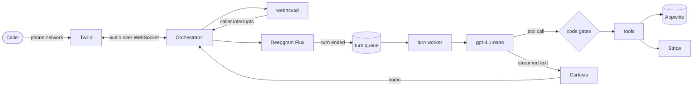

# Ovela

A voice AI receptionist that answers a real phone line, understands what the
caller needs, checks availability, finds their booking, takes new bookings and
hands them to a person when they ask — in real time, over the phone network.

Ovela is a **personal engineering project**, built and run in production by one
engineer. It is not a registered business and has no customers; the calls behind
the numbers below are my own test calls. Payments run in Stripe test mode and no
third-party booking system is connected — the demo property runs on its own
booking store.

---

## Architecture

A **cascaded voice pipeline**: each stage is a separate, specialised provider,
and a Python orchestrator owns the conversation — when a turn starts, when it
ends, when the caller interrupts, and what the agent is allowed to do.

| Layer | Technology | Responsibility |
|---|---|---|
| Telephony | Twilio Media Streams | Real phone number; bidirectional μ-law 8 kHz audio over WebSocket |
| Orchestrator | Python · FastAPI · asyncio, on Heroku | Turn-taking, interruption, call state, tool gating, tracing |
| Speech-to-text | Deepgram Flux | Streaming transcription and semantic end-of-turn detection |
| Interruption | webrtcvad (local) | 20 ms frame voice detection for barge-in |
| Reasoning | OpenAI `gpt-4.1-nano` | Replies and tool calls, streamed token by token |
| Text-to-speech | Cartesia `sonic-3` | Streaming speech synthesis, started on the first phrase |
| Data | Appwrite | Bookings, tenants and their configuration, call transcripts |
| Payments | Stripe (test mode) | Payment links for booking requests |
| Web | Next.js | Public site and the staff dashboard |

**Multi-tenant by design.** The number that was dialled selects the business.
Each tenant's voice, speaking speed, models and turn-taking thresholds live in
its configuration record rather than in code, every booking query is filtered by
tenant on the server, and tenant-specific code sits in its own module. One
tenant runs today: a demo modelled on a real regional motel's public details.

## How it works



**One call, turn by turn:**

1. The caller's number is looked up before the first word, so a returning guest's
   booking is already loaded when they start speaking.
2. Audio streams to Deepgram Flux, which decides when the caller has actually
   finished — pauses and "um"s do not end a turn.
3. The finished turn goes onto a queue. A single worker answers it, so the next
   thing the caller says is heard immediately and no two replies ever overlap.
4. The model replies with the call's established facts injected alongside the
   transcript. When it needs data it calls a tool — every tool that touches a
   booking, money or a person passes a check in code first.
5. The reply streams to Cartesia phrase by phrase; the caller hears the first
   words while the rest is still being written.
6. If the caller talks over the agent, audio stops, the part they actually heard
   is kept in the conversation, and the new question is answered. "Mhmm" and
   "go on" are recognised and let the agent continue.
7. At the end of the call the full transcript and its metadata are saved.

## What works today

- **Answers questions** about rooms, rates, availability and the property.
- **Finds a caller's booking** from their phone number, their name, or a name
  they spell out letter by letter — spelled letters always win over what speech
  recognition guessed.
- **Takes a booking request** only after reading the dates, room and price back
  and hearing the caller agree, then creates a payment link.
- **Transfers to a person** only once the caller has agreed to be put through.
- **Remembers the whole call.** Facts are held in three tiers — confirmed by a
  tool, said by the caller, or likely to change (like availability) — and
  re-injected every turn, so the agent still knows at turn 18 what was settled
  at turn 3.
- **Handles interruption like a person**: stops when interrupted, keeps what was
  heard, and ignores simple acknowledgements.
- **Keeps guest data out of the model's reach.** A guest's details are released
  to the conversation only after identity is confirmed in code.
- **Staff dashboard** with reservations, call logs, guests and notifications.

### Engineering decisions that made it reliable

- **Anything that can cost data, money or a promise is enforced in code, not in
  the prompt.** A guest's name kept in the prompt behind a "do not reveal" rule
  was volunteered on the first turn in **4 of 5** test runs. Kept out of the
  model's context and released by code, **0 of 5**. When the booking gate relied
  on a flag the model filled in, **4 of 7** booking attempts claimed a
  confirmation the caller never gave; the gate now reads the transcript.
- **Behaviour is measured as a rate, never a single run.** Tone and phrasing are
  tuned in the prompt and scored over repeated replays; boundaries are tested
  with the model out of the loop.
- **The model was chosen on the real workload.** Candidate models were
  benchmarked under the production prompt (~9,500 tokens, 12 tools), not a bare
  "hello" — the ranking reversed between the two.

## Measurements

Taken on my own test calls over the phone network, August–September 2026.
Each figure is a median with its sample size. These are updated after
significant changes, not continuously.

| Measure | Result | Sample |
|---|---|---|
| Reply time — caller stops speaking to first audio, no tool needed | **0.55–0.71 s** | 6 days, 12–51 turns each |
| Reply time when a tool is called (e.g. availability check) | **1.5–2.7 s** | 7 days, 2–22 turns each |
| Repeat booking lookup within a call | **1,073 ms → 0.4 ms** (per-call cache) | 15 → 21 lookups |
| Identifying a caller's booking from spoken details | **24 of 28** found, **0** matched to the wrong guest | 36 spoken queries |
| Interrupting a long reply | caught up to **6.5 s** into an answer | 6 interruptions |
| Automated tests | **2,036** passing | backend suite |

Replies that need no tool are inside the sub-second target. Replies that call a
tool are not yet — the tool round trip, not the model, is the remaining latency
work.

## Website

- **[ovela.dev](https://ovela.dev)** — what Ovela is and how it works, with a
  walkthrough of a booking call at [ovela.dev/demo](https://ovela.dev/demo).
- **Staff dashboard** (sign-in required) — reservations, call logs, guests,
  notifications and per-tenant settings.

## Running it

Backend (Python 3.12), from `backend/`:

```bash
python -m venv venv && source venv/bin/activate
pip install -r requirements.txt
uvicorn main:app --reload --port 8000
pytest
```

Requires `OPENAI_API_KEY`, `DEEPGRAM_API_KEY`, `CARTESIA_API_KEY`,
`APPWRITE_PROJECT_ID`, `APPWRITE_API_KEY` and `SMTP_PASSWORD` in `backend/.env`,
plus Twilio credentials for real calls.

Frontend (Node 20+), from `frontend/`:

```bash
npm install
npm run dev
```

---

Built by Dhruv Patel. Implementation was AI-assisted; the architecture,
measurement, debugging and corrections were mine.
