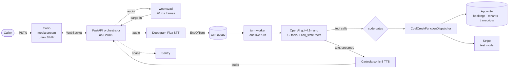

# Ovela

A voice AI receptionist that answers a real phone line, checks availability,
looks up and takes bookings, and hands the caller to a person when they ask for
one — built, measured and run in production as a **personal engineering
project**.

**Status, plainly.** Ovela runs on Heroku behind a real Australian phone number.
It is not a registered business, has no customers and has no pricing. Every call
in its traces and screenshots is a test call I made myself. Payments run in
Stripe test mode, and outbound email is switched off in production.

The code on this branch is one release ahead of production: the latest
turn-taking fixes (the turn queue and the backchannel vocabulary described
below) are written, tested and reviewed, but not yet deployed. Production runs
the release before them.

The interesting part is not that it talks. It's how it was made to talk
*reliably*, and how every claim about it was measured, and withdrawn when the
measurement turned out to be wrong.

---

## What ships

One conversational path runs in production: a **cascaded pipeline** in which each
stage is a separate provider, and the orchestrator decides when turns begin and
end.



- **Turn end comes only from Deepgram Flux's `EndOfTurn`.** Acoustic silence
  never triggers the model.
- **Barge-in is a separate signal**, from local `webrtcvad`, so a caller can
  interrupt a long answer. "Mhmm" and "go on" are recognised as a closed
  vocabulary and do not stop the agent; three-word questions such as "cancel
  my booking" do.
- **The read loop never waits for a reply.** Finished turns go onto a queue and
  one worker answers them one at a time, so the caller's next question is read
  the moment it's spoken and no two turns are ever live at once.
- **`call_state`** holds what the call has established in three tiers:
  *settled* (a tool confirmed it), *heard* (the caller said it, nothing verified
  it) and *perishable* (availability, payment status). It is re-injected as facts
  every turn, so the agent still knows at turn 18 what was settled at turn 3.
- **Anything that costs data, money or a promise is gated in code, not in the
  prompt.** Four gates sit in front of the tools: a transfer needs the caller's
  consent in the transcript, a booking needs a price-and-date summary the caller
  agreed to, a spelled-out name beats the phonetic guess, and changing a guest's
  details needs a confirmed identity. A guest's name that sat in the prompt
  marked "do not reveal" was volunteered on turn one in 4 of 5 replays; moved
  out of the context window and gated in code, 0 of 5.

## Measurements

From one paginated read of Sentry spans on 2026-09-16. Every number has its n,
and plain turns are never pooled with turns that call a tool. **Full tables,
method, and the numbers that must *not* be quoted:
[`docs/MEASUREMENTS.md`](docs/MEASUREMENTS.md).**

| measure | value | n |
|---|---|---|
| Plain turn: caller stops speaking → first audio, p50 | **551–706 ms** on each of six days | 12–51 per day |
| Turn that calls a tool, p50 | **1.5–2.7 s** on each of seven days | 2–22 per day |
| Plain turn, 18–21 Aug → 3–4 Sep | 647 → 594 ms (−8%) | 47 → 76 |
| Tool turn, 18–21 Aug → 3–4 Sep | 2180 → 1777 ms (−18%) | 26 → 15 |
| `lookup_booking`, repeat within a call | **1073 → 0.4 ms** | 15 → 21 |
| LLM first token, p50 | 420–468 ms, flat across releases | 11–51 per day |
| Barge-in depth into a long answer (v425) | up to 6.5 s; was dead after 3–4 s | 6 interruptions |

The biggest win was a per-call reservation cache, not the model. The remaining
latency problem is the tool round trip, not the LLM.

## Multi-tenancy

Built for more than one business; **exactly one tenant exists**.

- The number dialled resolves the tenant (`PHONE_TO_TENANT_MAP`, or a
  `?tenant_id=` on the Twilio webhook).
- Each tenant's configuration — voice, TTS model, speaking speed, LLM model,
  end-of-turn thresholds, staff contacts — lives in Appwrite `Tenants.config`,
  not in code, and is read at the start of every call.
- Tenant-specific code lives in `backend/services/tenants/<id>/`, with a
  `_template` for new ones.
- Booking reads and writes are filtered by `tenant_id` on the server
  (`backend/tests/test_db_isolation.py`), and rate limits are keyed by caller
  and tenant.

The demo tenant is modelled on **Coal Creek Motel**, a real motel in Korumburra,
Victoria, using its public details so the conversation has something realistic
to talk about. The motel is not a customer and has not used or endorsed Ovela.

## What this repo does not claim

- **That Ovela is a business.** No customers, no revenue, no pricing, no
  registered company.
- **Any third-party booking-system integration.** Availability and bookings sit
  behind one adapter interface (`services/pms/`); the only client in it is a
  stub whose endpoint URLs are placeholders. The demo runs on its own store.
- **A current latency median for the newest code.** The latest turn-taking fix
  is written and reviewed but not deployed; the release before it had a fault
  that hid up to ~6 s of the caller's wait from every span. See
  [Do not quote](docs/MEASUREMENTS.md#do-not-quote).
- **That tool turns meet the 800 ms target.** They don't. Plain turns do.
- **A quality score.** The Google-hackathon harness produced a score in August
  against a different conversational driver; it isn't a current measure. What it
  tested is described in
  [`docs/EVALUATION_METHODOLOGY.md`](docs/EVALUATION_METHODOLOGY.md), including
  a latency claim that has since been withdrawn.
- **A clean test run.** `pytest` in `backend/`: **2036 passed, 8 failed** as of
  2026-09-16. The 8 are long-standing — five in the Stripe/email test file and
  three older assertions — and are listed, not hidden.
- **That booking confirmations reach anyone.** Outbound email is off in
  production, and payment links are Stripe test mode.

## History — older paths, kept and dated

Nothing has been deleted; these are how the project got here.

- **Google agentic hackathon (submitted June 2026; `main` as of 13 July 2026).**
  The original version: a Google
  ADK multi-agent graph on Gemini 2.5 Flash as the conversational driver, with
  the README, evaluation write-up and screenshots of the time. Preserved at the
  tag [`google-agentic-hackathon`](https://github.com/My-CMDhub/Ovela-AI/tree/google-agentic-hackathon).
  The ADK code still lives in `backend/services/adk/`; in the shipping path it
  only serves an optional background search (`fire_adk_cold_path`).
- **Monolithic path (superseded).** `backend/services/voice_agent/handler.py`
  used Deepgram's Voice Agent API as a single speech-to-speech hop. Replaced by
  the cascaded pipeline, which exposes each stage's timing and lets the
  orchestrator own interruption. Selectable with `VOICE_PIPELINE_MODE`, and not
  what runs.
- **DEV Summer Bug Smash (August 2026).** Six stacked pull requests, each a
  class of production bug found in the cascaded pipeline, with Sentry evidence:
  [#7](https://github.com/My-CMDhub/Ovela-AI/pull/7) provider bridges ·
  [#8](https://github.com/My-CMDhub/Ovela-AI/pull/8) barge-in ·
  [#9](https://github.com/My-CMDhub/Ovela-AI/pull/9) turn loop ·
  [#10](https://github.com/My-CMDhub/Ovela-AI/pull/10) control flow and cold start ·
  [#11](https://github.com/My-CMDhub/Ovela-AI/pull/11) telemetry ·
  [#12](https://github.com/My-CMDhub/Ovela-AI/pull/12) redundant work.
  The screenshots are captioned in [`traces/`](traces/README.md).

## Running it

Backend (Python 3.12), from `backend/`:

```bash
python -m venv venv && source venv/bin/activate
pip install -r requirements.txt
uvicorn main:app --reload --port 8000
pytest
```

It needs at least `OPENAI_API_KEY`, `DEEPGRAM_API_KEY`, `CARTESIA_API_KEY`,
`APPWRITE_PROJECT_ID`, `APPWRITE_API_KEY` and `SMTP_PASSWORD` in `backend/.env`,
plus Twilio credentials for real calls. Everything else in `core/config.py` has a
default.

Dashboard and site (Node 20+), from `frontend/`:

```bash
npm install
npm run dev
```

Re-read the latency numbers yourself, from `backend/`:

```bash
python -m scripts.analyze_trace --period 30d --by-day --by-kind --no-gemini
```

---

Implementation was AI-assisted (Claude Code). The architecture, the
measurement, the debugging and the corrections were mine.
