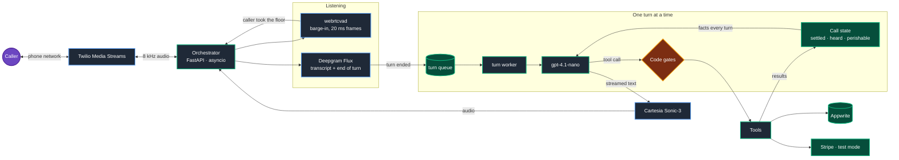

<div align="center">
  

  <br />

  **A voice receptionist on a real phone line, built for the parts of a phone call that usually go wrong.**

  <br />

  [](#architecture)
  [](#architecture)
  [](#decisions-that-make-it-different)
  [-0.55--0.71%20s-success?style=flat-square)](#measurements)
  [](#running-it)
  [](#why-this-exists)
</div>

<br />

## Why this exists

There are hundreds of voice-agent demos online, and nearly all of them show the
happy path: the caller asks, the agent answers, everyone waits their turn. Real
calls aren't like that. People talk over you, say "mhmm" while you're
mid-sentence, spell their name because they know you'll mishear it, say "yes" to
the wrong question, and expect you to remember at minute six what they told you
at minute one.

A good receptionist handles all of that without thinking. Ovela is my attempt to
turn those human habits — taking turns, being interrupted, remembering what was
settled, asking before acting — into a system reliable enough to trust. It is
built and measured around the failure modes, not the demo.

It is a personal engineering project running on a real phone line. It is not a
business and has no customers: every call behind the numbers below is one of my
own test calls, Stripe runs in test mode, and no third-party booking system is
connected — the demo motel runs on its own booking store.

## Architecture

A cascaded pipeline: speech-to-text, the language model and text-to-speech are
separate streaming providers, and a Python orchestrator owns the conversation —
when a turn ends, when the caller has taken the floor, what the call has
established, and what the agent is allowed to do.



| Layer | Technology | Job |
| --- | --- | --- |
| Telephony | Twilio Media Streams | Real number, two-way μ-law 8 kHz audio over WebSocket |
| Orchestrator | Python, FastAPI, asyncio on Heroku | Turn-taking, interruption, call state, tool gating, tracing |
| Speech-to-text | Deepgram Flux | Streaming transcript and semantic end-of-turn |
| Barge-in | webrtcvad (local) | Detects the caller speaking over the agent |
| Reasoning | OpenAI `gpt-4.1-nano` | Replies and tool calls, streamed |
| Text-to-speech | Cartesia `sonic-3` | Speech synthesis, starting on the first phrase |
| Data | Appwrite | Bookings, tenant configuration, call transcripts |
| Web | Next.js | Public site and staff dashboard |

Voice, speaking speed, model and turn-taking thresholds come from a per-tenant
configuration record, not from code.

## One call, turn by turn

1. **Before the caller speaks**, the booking attached to their number is fetched
   in the background — but only the fact that a reservation exists is shared. The
   guest's name stays out of the conversation.
2. **Deepgram Flux decides when the caller has finished.** Pauses and "um"s don't
   end a turn, and silence alone never triggers a reply.
3. **The finished turn goes onto a queue, and one worker answers it.** The next
   thing the caller says is read immediately, and two replies are never live at
   once.
4. **The model gets the recent transcript plus the call state** — what's settled,
   what was only heard, and what may have changed since.
5. **Four actions are gated in code**: transferring to a person, creating a
   booking, writing a spelled name, and changing a reservation before the caller
   is identified. Read-only lookups are not gated.
6. **The reply streams to Cartesia phrase by phrase**, so the caller hears the
   first words while the rest is still being written.
7. **If the caller talks over the agent**, audio stops, the part they heard is
   kept in the agent's memory, and the new question is answered. "Mhmm" and
   "go on" are recognised and the agent carries on.
8. **When the call ends**, the transcript is saved with its barge-ins,
   backchannels, tools called, gate refusals, and any number the agent said that
   no tool supplied.

## Decisions that make it different

**Agreeing to one thing isn't agreeing to everything.**
The booking tool used to trust a flag the model filled in to say the summary had
been read back. In 4 of 7 booking attempts it claimed a confirmation the caller
never gave — in one, a "yes" to an email spelling became a booked room. The gate
now reads the transcript: a name, a price and dates spoken by the agent, followed
by the caller agreeing to *that*. Transfers to a person work the same way and need
the caller to ask for one or accept the offer.

**A receptionist doesn't read out someone's details before knowing who's calling.**
With the guest's name in the prompt behind a "do not reveal" rule, the agent
volunteered it on the first turn in **4 of 5** replays. Now the lookup tool
withholds it and code releases it only after identity is confirmed: **0 of 5**.
Anything that could cost data, money or a promise is enforced this way; tone and
phrasing stay in the prompt and are measured as rates over repeated runs.

**When someone spells their name, the letters win.**
Speech recognition transcribed "s i o b h a n" perfectly, and the booking was
still written as "Cyborn". Spelled letters are now captured from the caller's own
words, and any booking or update that doesn't contain them is refused.

**Being unsure is better than guessing.**
Name matching answers only when one guest is clearly ahead of every other. If two
guests both fit — Katherine Smyth and Catherine Smith — it declines and asks for
a phone number, reference or email, even when one of them matches exactly.

**Remember what was settled, and know the difference between knowing and hearing.**
Tool results leave the model's context after each turn, so a long call used to
forget a booking reference it had looked up on turn 2. The orchestrator now keeps
the facts itself in three labelled tiers, re-sent every turn: *settled* (a tool
confirmed it), *heard* (the caller said it, nothing has checked it) and
*perishable* (availability, re-checked before any promise).

**The question isn't "can the agent stop talking?" — it's "what did the caller actually hear?"**
Text is generated faster than it is spoken, so when a caller cuts in, the model
has already "said" words the caller never heard. Ovela keeps only the part that
played — estimated from audio Twilio confirms it delivered, trimmed to the last
full sentence — so the agent doesn't assume context the caller never received.
And "mhmm" isn't an interruption: cutting in takes about half a second of
sustained speech or words that aren't continuers.

**The model was chosen on the real workload.**
Candidates were benchmarked under the production prompt (~9,500 tokens,
12 tools), not a bare "hello". `gpt-4o-mini` won on the bare "hello" and was
2.7× slower than `gpt-4.1-nano` under the real prompt.

## What works today

- Answers questions about rooms, rates, availability and the property.
- Finds a caller's booking from their number, a reference, their email, their
  name, or a name spelled letter by letter.
- Takes a booking request after reading it back and hearing agreement, then
  creates a payment link (Stripe test mode).
- Transfers to a person only with the caller's consent.
- Resolves relative dates — "this weekend" and "next weekend" are different
  weekends.
- Staff dashboard for reservations, call logs and guests.

## Measurements

Measured on my own test calls over the phone network, August–September 2026.
Medians, with sample sizes; updated after significant changes, not continuously.

| Measure | Result | Sample |
| --- | --- | --- |
| Reply time, no tool: turn end detected → first audio sent | **0.55–0.71 s** | 6 days, 12–51 turns each |
| Reply time when a tool runs (e.g. availability) | **1.5–2.7 s** | 7 days, 2–22 turns each |
| Repeat booking lookup within a call | **1,073 ms → 0.4 ms** (per-call cache) | 15 → 21 lookups |
| Finding a guest from misheard details | **24 of 28** real guests found; **0** of 8 non-guests invented; **0** wrong guest | 36 transcription-style queries ([`eval_identity.py`](backend/scripts/eval_identity.py)) |
| Guest name volunteered before identification | **4 of 5 → 0 of 5** | scripted replays ([`replay_conversation.py`](backend/scripts/replay_conversation.py)) |
| Interrupting a long reply | caught up to **6.5 s** into an answer | 6 interruptions |
| Automated tests | **1,922** passing | tracked backend suite |

Reply time starts when Deepgram reports the end of turn, so it excludes
Deepgram's own end-of-turn decision. Replies without a tool are under a second;
replies with a tool aren't yet — the remaining latency is the tool round trip,
not the model.

## Known limits

- **Identity is confirmed on one matching word of the name.** A relative on the
  same phone who shares the surname passes.
- **The gates judge agreement from word patterns in the transcript**, not full
  understanding, so an unusual way of saying yes can be refused.
- **Reply time is measured to audio sent**, and excludes Deepgram's own
  end-of-turn decision.
- **One tenant, and every call is my own** — nothing here has met a real
  customer yet.

## Try it

**[ovela.dev](https://ovela.dev)** — the demo opens from the landing page.

## Running it

Backend (Python 3.12), from `backend/`:

```bash
python -m venv venv && source venv/bin/activate
pip install -r requirements.txt
uvicorn main:app --reload --port 8000
pytest
```

Needs `OPENAI_API_KEY`, `DEEPGRAM_API_KEY`, `CARTESIA_API_KEY`,
`APPWRITE_PROJECT_ID`, `APPWRITE_API_KEY` and `SMTP_PASSWORD` in `backend/.env`,
plus Twilio credentials for real calls.

Frontend (Node 20+), from `frontend/`:

```bash
npm install
npm run dev
```

---

Built by Dhruv Patel. Implementation was AI-assisted; the architecture,
measurement, debugging and corrections were mine.

<p align="center"><i>Ovela is not a finished answer to human conversation. It’s an ongoing attempt to understand it—one call, one interaction, and one lesson at a time. ✧</i></p>
