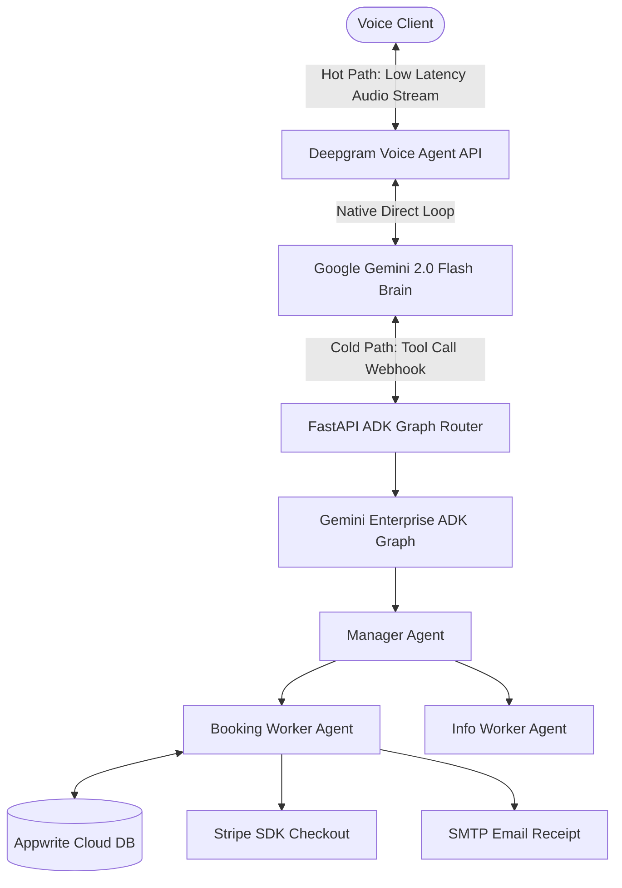

# Ovela AI - Current System Status & Context

Tracks the current live architecture, implementation state of modules, design decisions, active risks, and database guardrails for Ovela AI.

---

## 🛠️ Technology Stack & Architecture

- **Frontend:** Next.js 14, TypeScript, Tailwind CSS, Appwrite Web SDK (Turbopack builds pass)
- **Backend:** FastAPI (Python 3.10+), Uvicorn, pytest, stripe, google-adk-python (Vertex AI Graph routing)
- **Database & Storage:** Appwrite Cloud
- **Communications:** Twilio Voice, Cartesia Sonic-3 (TTS), Deepgram Voice Agent API (STT + Gemini 2.0 Flash)

### 🎙️ Core Hot/Cold Path Separation

---

## 📦 Module Implementation State

| Module | Status | Verification / Evidence |
|---|---|---|
| **Frontend Dashboard** | `STABLE` | Next.js compilation completes with 0 errors. |
| **FastAPI Backend** | `STABLE` | Outdated Meta/WhatsApp routes permanently purged. 16 pytest unit tests passing. |
| **Twilio Live Voice Stream** | `PRODUCTION READY` | Twilio media streams bridged. Dynamic greeting waits & double filler protections active. |
| **Gemini Enterprise ADK Graph** | `IMPLEMENTED` | `backend/services/adk/graph.py` — OvelaManager → BookingWorker + InfoWorker. google-adk 2.0.0. 4 tests green. |
| **CallerMemoryBank** | `IMPLEMENTED` | `backend/services/voice_agent/memory.py` — get_profile + save_profile. 5 tests green. Error-contained. |
| **Conversational Hardening** | `PENDING` | Task 3: Interruption trimming (trim_assistant_transcript) not yet implemented. |
| **Stripe Payments** | `PENDING` | Task 4: stripe_handlers.py not yet built. |

---

## ⚡ Active Risks & Mitigation Plan

1. **Speech Latency Regressions on Graph Handoffs:** Multi-agent task sharing can introduce latency delays if done synchronously in the speech loop.
   - *Mitigation:* Live speech runs natively through Deepgram's direct Gemini Flash connector (Hot Path). Complex B2B bookings, Stripe billing, and database updates execute asynchronously via FastAPI ADK webhook tool triggers (Cold Path).
2. **Twilio Buffer Clears wiping Injected Filler Audio:** Twilio WebSocket `clear` messages can erase pending fallback filler phrases if sent during active playback.
   - *Mitigation:* Strict clear-event guards block Twilio `clear` signals whenever the agent is processing async tools (`_is_processing_function = True`).
3. **Conversational Amnesia from Interruption Lag:** TTS speech delivery is slower than generation. The LLM believes a sentence was spoken when VAD interrupted after the first word.
   - *Mitigation:* Task 3 implements `trim_assistant_transcript(text, elapsed_seconds, wpm=150)` to prune the history.
4. **`_transfer_tts_done` Event Is Declared But Never Awaited:** Ghost state in handler.py. Low priority — transfer flow works via TwiML update path. Flag for cleanup in Phase 3.
5. **Silence Monitor Rescheduling Has No Max-Cap:** `paused_on_request` can loop indefinitely if cleanup races. Probability low — guarded by `is_running` check. Flag for Phase 3.

---

## 🛡️ Database & Security Guardrails

- [x] All Appwrite queries default strictly to the `coalcreek` tenant.
- [x] All availability inquiries check all room types in a single request using `room_type='any'` first to avoid database locking.
- [x] WhatsApp meta webhook routes are permanently unregistered and return 404.
