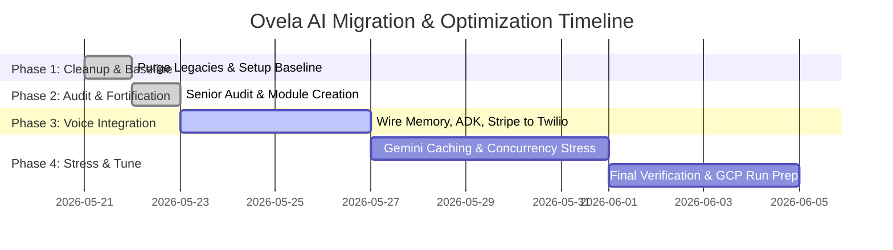

# Ovela AI - Broad Implementation Artifact

This file contains the high-level strategic roadmap, architectural blueprint, phase details, and future plan for Ovela AI's migration to the Gemini Enterprise Agent Platform.

---

## 🎯 High-Level Vision & Phases

Our objective is to migrate Ovela AI from a prototype sandbox into a production-grade conversational voice agent built on the **Gemini Enterprise Agent Platform (Vertex AI & Agent Development Kit - ADK)** for the **Google for Startups AI Agents Challenge 2026**.

---

## 🗺️ Migration Roadmap

### Phase 1: Context Harvesting & Baseline Cleanup [100% COMPLETE]
- Cleaned up obsolete WhatsApp webhook APIs and legacy mock data.
- Refactored backend settings and updated all configurations to default to the `coalcreek` tenant.
- Verified system integrity with 7 green backend unit tests.
- Staged and committed clean workspace base on branch `feat/gemini-adk-migration`.

### Phase 2: Senior-Level Audit & Module Fortification [100% COMPLETE]
- **Architectural Audit & Latency Review:** A deep, surgical audit of `handler.py` to expose silent bottlenecks, context sync flaws, and VAD timings. Arg-inversion on filler phrases and CRM summary bugs fixed in production.
- **Stateful ADK Graph Integration:** Created `backend/services/adk/graph.py` with multi-agent Vertex AI routing (Manager, Booking Worker, Info Worker) utilizing declarative `google-adk 2.0.0` schemas and isolated session memory.
- **Persistent Caller Memory Bank:** Created `backend/services/voice_agent/memory.py` with Appwrite profile recognition hooks, error-contained for zero websocket lag.
- **Dynamic Interruption Trimming:** Built exact conversational speed VAD trimming (~150 WPM) in `handler.py` to keep prompt histories in-sync with what the guest *actually* heard.
- **Stripe Automated Payments:** Created `backend/services/voice_agent/functions/stripe_handlers.py` for dynamichosted payment links in AUD.
- **Verification Gates:** Completed **30 / 30 backend unit tests green**.

### Phase 3: Voice Agent Integration & Bridging [100% COMPLETE]
- **Task 1 — CallerMemoryBank Hookup:** `CallerMemoryBank` wired into `_handle_twilio_start`. Returning guest profile (name, room_preference) injected into `self.memory` before Deepgram Settings are sent. `save_profile()` fired on `update_guest_info` success.
- **Task 2 — ADK Graph Webhook:** `ADKOrchestrator` singleton in `app.state` (startup_event). `/api/adk/query` + `/api/adk/health` endpoints live. `fire_adk_cold_path()` fires after booking success as background task.
- **Task 3 — Stripe Dispatch:** `create_checkout_session()` fires as `asyncio.create_task` after booking confirmation. Payment link SMS'd via `staff_notification_service`. Graceful fallback if key missing.
- **Verification Gates:** 37 / 37 backend unit tests green.

### Phase 4: Stress Testing, Caching & Performance [ACTIVE]
- Gemini Prompt Caching in ADK LlmAgent models to reduce token overhead.
- Interruption System Tags on VAD triggers.
- Behind-the-scenes live visual feed UI in Next.js dashboard.
- Concurrency stress tests under 3 concurrent WebSocket calls.
- GCP Cloud Run deployment and final judging demo dry-run.

---

## 🚀 Key Future Plans

1. **Self-Optimizing Prompts:** Introduce automated prompt refining loops that analyze failed client transcripts and patch worker instructions autonomously.
2. **Multi-lingual Voice Matching:** Support auto-detection of client spoken languages (Spanish, French, Arabic) with native accents.
3. **Advanced Calendar Sync:** Integrations with booking giants (Fresha, Mindbody, Acuity) to sync studio availability in real-time.
