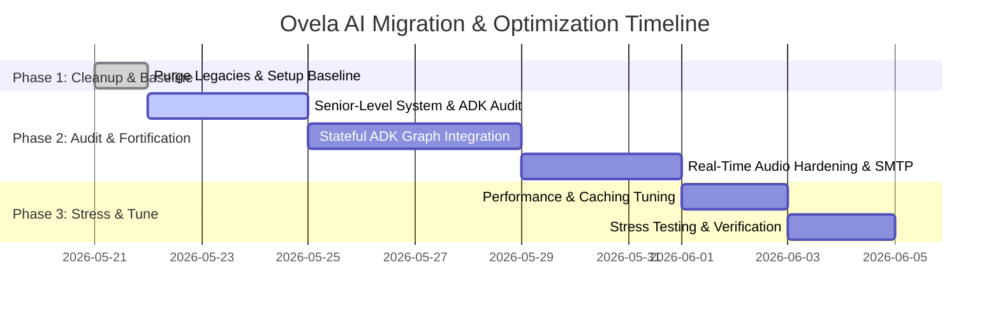

# Ovela AI - Broad Implementation Artifact

This file contains the high-level strategic roadmap, architectural blueprint, phase details, and future plan for Ovela AI's migration to the Gemini Enterprise Agent Platform.

---

## 🎯 High-Level Vision & Phases

Our objective is to migrate Ovela AI from a prototype sandbox into a production-grade conversational voice agent built on the **Gemini Enterprise Agent Platform (Vertex AI & Agent Development Kit - ADK)** for the **Google for Startups AI Agents Challenge 2026**.

---

## 🗺️ Migration Roadmap

### Phase 1: Context Harvesting & Baseline Cleanup [100% COMPLETE]
- Cleaned up obsolete WhatsApp webhook APIs and legacy mock data.
- Refactored backend settings and updated all configurations to default to the `coalcreek` tenant.
- Verified system integrity with 7 green backend unit tests.
- Staged and committed clean workspace base on branch `feat/gemini-adk-migration`.

### Phase 2: Senior-Level Audit & System Fortification [ACTIVE]
- **Task 1: Comprehensive System Audit & Latency Review:** A deep, surgical audit of `/Applications/Journey of pro/Nona/backend/services/voice_agent` to expose silent bottlenecks, context sync flaws, VAD timings, and race conditions.
- **Task 2: Stateful ADK Graph Integration:** Multi-agent Vertex AI graph routing (Manager, Booking Worker, Info Worker) with unified Session state persistence to support complex transactional logic.
- **Task 3: Production-Grade Hardening (Stripe & Emails):** Dynamic invoice/checkout URL generation mid-call, integrated with beautiful SMTP confirmation layouts.
- **Task 4: Conversational Quality & Hardening:** Real-time speech-rate playback pruning (~150 WPM) on interruption VAD events, plus Gemini Prompt Caching token optimization.

### Phase 3: Stress Testing, Caching & Performance [UPCOMING]
- Optimization of model costs and speed via Gemini Prompt Caching.
- Multi-agent concurrent load testing.
- Static analysis and typescript safety audits.

---

## 🚀 Key Future Plans

1. **Self-Optimizing Prompts:** Introduce automated prompt refining loops that analyze failed client transcripts and patch worker instructions autonomously.
2. **Multi-lingual Voice Matching:** Support auto-detection of client spoken languages (Spanish, French, Arabic) with native accents.
3. **Advanced Calendar Sync:** Integrations with booking giants (Fresha, Mindbody, Acuity) to sync studio availability in real-time.
